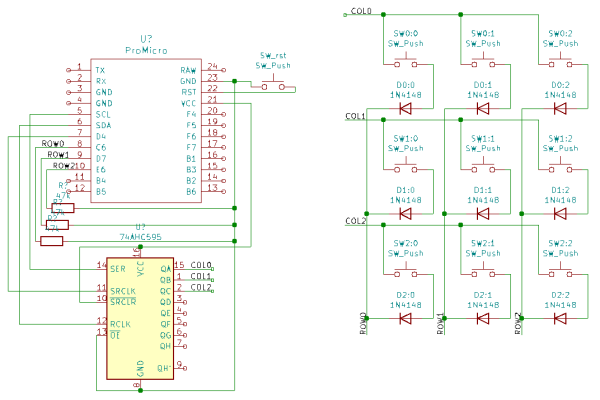

# What if we use a 74HC595 to handle the columns?

I/Os are limited on a poor ProMicro, let's try to use a Serial-in-Parallel-out shift register (onwards called SR) to circumvent that limitation.

## Custom Matrix
In order to implement it in QMK, we need to use a custom matrix implementation.
QMK offers [some documentation on the matter](https://github.com/qmk/qmk_firmware/blob/master/docs/

## Updated schematic

custom_matrix.md). We are going for a full replacement.

## Troubleshooting
**You can't have hypens `-` in the dir name of the keyboard firmware.**

## References and resources
- [Great write-up from mehmedbasic](https://mehmedbasic.dk/post/74hc595-keyboard/)
Note that some of is schematics seem wrong. The `!SRCLR` (11) and `VCC` (16)  pins should be connected to 5V, and the `!OE` (13) pin to the ground.
- [The full keyboard firmware of mehmedbasic](https://github.com/ripdajacker/qmk_firmware/tree/yogaext/keyboards/ripdajacker/yogaext)
- [Basic usage from aduino.cc](https://www.arduino.cc/en/Tutorial/Foundations/ShiftOut)
- [74HC595 datasheet](https://www.ti.com/lit/ds/scls041i/scls041i.pdf?ts=1613947557756&ref_url=https%253A%252F%252Fwww.google.com%252F)