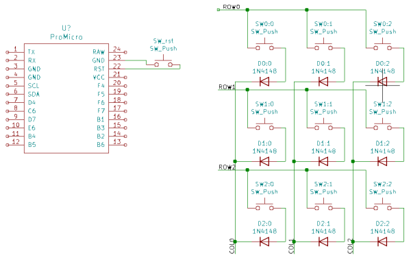
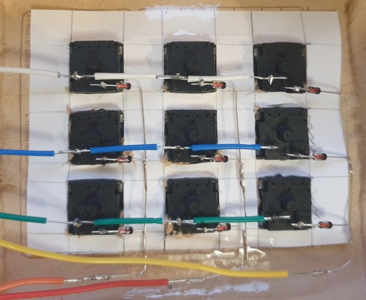
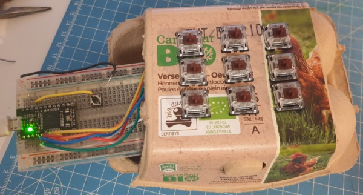

# Write-up of a first attempt on a 9 keys keyboard using QMK

## KiCAD schematic

[Pro Micro library](https://github.com/Biacco42/ProMicroKiCad)




## QMK firmware
[Installation guide](https://docs.qmk.fm/#/newbs_getting_started)

*Note:* The pip package seems broken, the `community/qmk` is fine, though.


### Create a new keymap
If you just want to update the layout of an existing keyboard, you can just create a new keymap like so:
```
$ qmk new-keymap -kb clueboard/66/rev4
```
Where `clueboard/66/rev4` is a [66% keyboard](https://github.com/qmk/qmk_firmware/tree/master/keyboards/clueboard/66/rev4) that will be used as a basis for the new keymap.

However, if you want to create a whole new keyboard, you better copy a complete tree, like the `clueboard/66/rev4` which as a ProMicro implementation.

Check the [firmware](https://github.com/parastuffs/mesange_keyboard/tree/main/9-keys/firmware/9keys) to see how it works, everything is pretty straightforward.

We have the following tree:
```
.
├── 9keys.c
├── 9keys.h
├── config.h
├── info.json
├── keymaps
│   └── default
│       └── keymap.c
├── rules.mk
└── v0
    └── promicro
        ├── config.h
        ├── promicro.c
        ├── promicro.h
        ├── readme.md
        └── rules.mk
```
- Keymap: `keymaps/default/keymap.c`
- Pinout: `v0/promicro/config.h`
- Layout: `v0/promicro/promicro.h` and `9keys.h`
- Layout coordinates: `info.json`

### Compile & upload
Following the above tree:

`$ qmk compile -kb 9keys/v0/promicro -km default`

Don't forget to short the `reset` pin to ground to put the ProMicro intro bootloader mode, then:

```
$ avrdude -F -V -c avr109 -p atmega32u4 -P /dev/ttyACM0 -b 115200 -U flash:w:/home/para/qmk_firmware/.build/9keys_v0_promicro_default.hex
```

## Wiring

Just follow the schematics, get creative and crafty.



Don't forget (like I did) that you are working on the backside of the keyboard, hence inverting the matrix.

## Result




## Troubleshooting

### Can't compile a keyboard with QMK

`/usr/bin/avr-ld: error while loading shared libraries: libctf.so.0: cannot open shared object file: No such file or directory`

```
[para@para-manjaro ~]$ lddtree /usr/bin/avr-ld
/usr/bin/avr-ld (interpreter => /lib64/ld-linux-x86-64.so.2)
    libbfd-2.35.1.so => /usr/x86_64-pc-linux-gnu/avr/lib/libbfd-2.35.1.so
    libctf.so.0 => None
    libdl.so.2 => /usr/lib/libdl.so.2
    libc.so.6 => /usr/lib/libc.so.6
```

The library is missing and seems to be a [bug from binutils](https://bugs.archlinux.org/task/69567).
A solution is to downgrade the package, using `asp` for example.

However, the latter can't be found in the repository, even though [it's supposed to be in extra](https://archlinux.org/packages/extra/any/asp/).

We can then fetch the `PKGBUILD` file [here](https://raw.githubusercontent.com/archlinux/svntogit-packages/packages/asp/trunk/PKGBUILD) and [install the package using it](https://raspberrypi.stackexchange.com/questions/510/how-do-i-install-packages-from-the-aur)

Add the repo key so that pacman is happy. The key is in the `PKGBUILD`.
```
$ gpg --recv-keys 487EACC08557AD082088DABA1EB2638FF56C0C53
```

From the directory containing the `PKGBUILD`:
```
$ makepkg -Acs
$ sudo pacman -U asp-6-2-any.pkg.tar.zst
```

Now we can finaly downgrade binutils:
```
asp checkout binutils
cd binutils
git checkout 3647ee5
cd trunk
makepkg -sci
```

Now it works:
```
$ qmk compile -kb clueboard/66/rev3 -km default
```