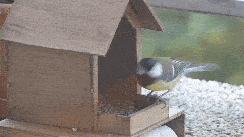

# The Mésange Project - A Custom Keyboard

Isn't she the cutest?

## References

[Custom 60% Bluetooth Keyboard, from teaandtechtime.com](https://teaandtechtime.com/custom-60-percent-bluetooth-keyboard/), nice for bluetooth uC and shift registers.

[ATMega32u4: Scanning a full-size keyboard matrix with two 74hc595 in series, from mehmedbasic.dk](https://mehmedbasic.dk/post/74hc595-keyboard/), how to interface shift registers and an ATMega32u432u4.

[Deskthority wiki pages](https://deskthority.net/wiki/Main_Page), lots of awesome resources about [PCB design](https://deskthority.net/wiki/KiCAD_keyboard_PCB_design_guide), [switches](https://deskthority.net/wiki/Cherry_MX), [controller boards](https://deskthority.net/wiki/Category:Controller_boards), [ghosting](https://deskthority.net/wiki/Rollover,_blocking_and_ghosting), etc.

[Mechanical Keyboard and where to find them](https://github.com/help-14/mechanical-keyboard), loads of open source keyboards.

[Custom keyboards on reddit](https://www.reddit.com/r/MechanicalKeyboards/wiki/customkeyboards), thread with lots of external references.

[Mechanical properties of Cherry MX switches](https://www.cherrymx.de/en/dev.html)

[QMK firmware](https://github.com/qmk/qmk_firmware)

[TMK firmware](https://github.com/tmk/tmk_keyboard)

[Adafruit Feather M0 Bluefruit](https://learn.adafruit.com/adafruit-feather-m0-bluefruit-le?view=all)