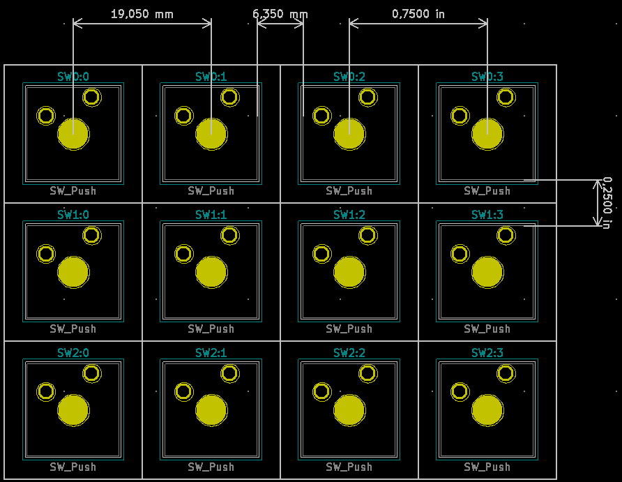

# 4-by-5 macro pad

## The way the logic works
Current is sourced from the 74HC959 and sinked at the ProMicro pin.
If we have 5 rows and 4 columns of keys, the rows should be connected to the ProMicro i/o and the columns to the shift register.
We thus end up with current flowing from columns to rows, pay attention to the direction of the diodes.

74HC595 -> Column -> diode -> switch -> row -> ProMicro

## Keys spacing on PCB
The standard measurement unit for a key is `1u`, which is `0.75"`, or `19.05mm`.
The center-to-center distance is supposed to be 1u as well and the edge-to-edge distance is 1/4", i.e. 6.35mm.

The footprints from the `Button_Switch_Keyboard` library have a handy white outline on the `Dwgs.User` layer that delimits the keycap area.